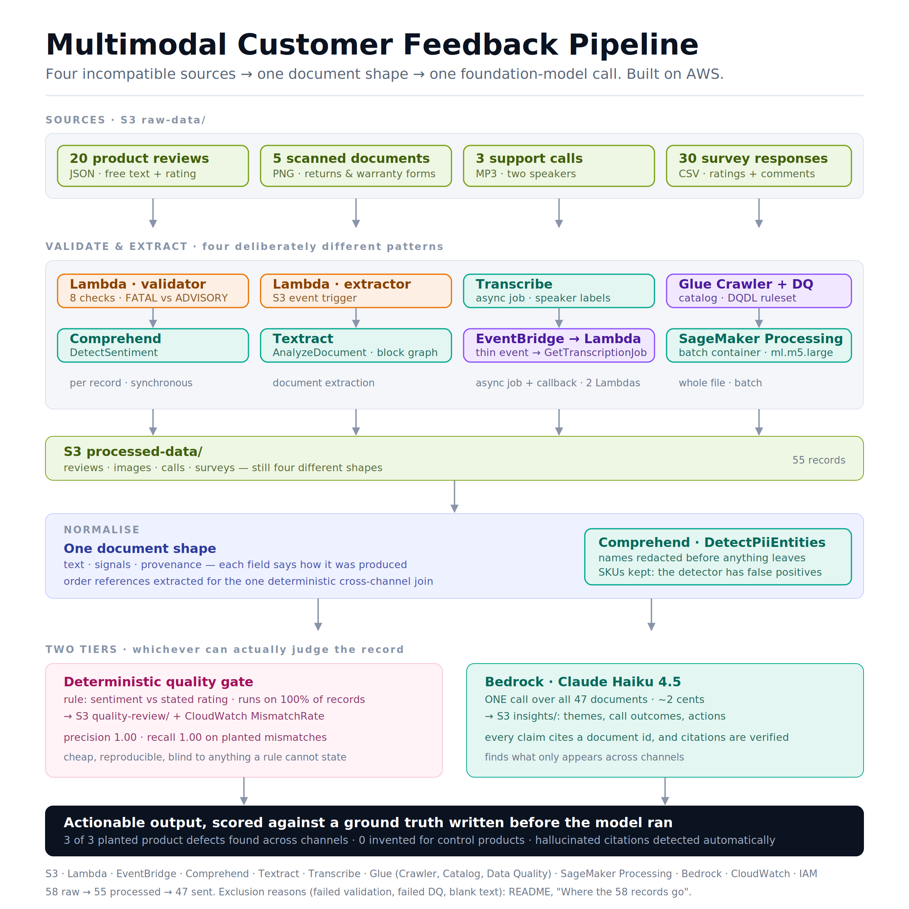

# Multimodal Customer Feedback Pipeline (AWS)

A data validation and processing pipeline that turns four incompatible feedback
sources — product reviews, scanned documents, support call recordings and survey
exports — into one format a foundation model can reason over, then uses Claude on
Bedrock to find issues that only appear when you look across all four at once.

Built on AWS with S3, Lambda, EventBridge, Comprehend, Textract, Transcribe,
Glue (Crawler / Data Catalog / Data Quality), SageMaker Processing, CloudWatch,
IAM and Bedrock.

**Every design choice here was measured, and the measurements are in the repo.**
Where a service turned out to be the wrong tool, that is documented rather than
hidden — see [docs/production-gaps.md](docs/production-gaps.md).

---

## The pipeline



    raw-data/reviews/*.json ──▶ Lambda validator ──▶ validation-results/
                                        └──▶ Lambda + Comprehend ──▶ processed-data/reviews/
    raw-data/images/*.png   ──▶ Lambda + Textract ─────────────────▶ processed-data/images/
    raw-data/calls/*.mp3    ──▶ Lambda ──▶ Transcribe (async)
                                     └──▶ EventBridge ──▶ Lambda + Comprehend
                                                             └──────▶ processed-data/calls/
    raw-data/surveys/*.csv  ──▶ Glue Crawler ──▶ Catalog ──▶ Glue Data Quality
                            └──▶ SageMaker Processing ─────────────▶ processed-data/surveys/

                       processed-data/  ──▶  one normalised document shape
                                              ├──▶ Comprehend PII redaction
                                              ├──▶ ONE Bedrock call ──▶ insights/
                                              └──▶ rule-based quality gate ──▶ quality-review/


## Four integration patterns, deliberately

| Source | Service | Pattern |
|---|---|---|
| Reviews | Comprehend | Event-driven, per record, synchronous |
| Images | Textract | Event-driven, document extraction |
| Calls | Transcribe + Comprehend | Event-driven, **async job + EventBridge callback, two Lambdas** |
| Surveys | SageMaker Processing | Batch, container, whole file |

Making all four Lambdas would have taught one pattern four times.

## What was measured

Ground truth was written **before** the model ran
([data/ground_truth.json](data/ground_truth.json)): three products with a
planted defect, two clean controls, five planted rating/sentiment mismatches
named by document id. Both the model and the rule-based gate are scored against
the same records.

**Where the 58 records go**

The dataset is 58 raw records (20 reviews + 5 scanned forms + 3 calls + 30
survey rows). Not all of them reach Bedrock, and each drop is a logged
decision, not data loss:

| Stage | Count | What drops, and why |
|---|---|---|
| Raw sources | 58 | `raw-data/` |
| Reaches `processed-data/` | 55 | 3 reviews fail a FATAL check in [`lambda/text_validator.py`](lambda/text_validator.py) and are never written: `review_003` (text is "Bad.", under the 10-character minimum), `review_007` (no `product_id` to attribute it to), `review_011` (`rating: 6`, out of the 1-5 range) |
| Sent to Bedrock | 47 | 6 more excluded in `admissible_only()` ([`processing/feedback_document.py`](processing/feedback_document.py)): 2 survey rows fail a FATAL Glue DQ check (blank `customer_id`, blank `survey_date`); 4 more pass DQ (`comments_present` is only ADVISORY) but have an empty `comments` field, so there is no text for the model to read. The remaining 2 were not re-verified against a live run's S3 output. |

`manifest()` records `documents_total`, `documents_sent` and `excluded`
alongside every run, so this shrinkage is visible in the output itself, not
just in this table.

**Finding cross-channel issues (Claude Haiku 4.5, 47 documents, one call)**

| Check | Result |
|---|---|
| Planted product issues found | 3 / 3, all cross-channel, all cited |
| Issues invented for control products | none |
| Citation integrity | one run cited a document that was excluded from the batch — caught automatically |

**Detecting rating/sentiment contradictions — rule vs model, same task**

| | Rule (`processing/quality_review.py`) | Haiku (3 runs) |
|---|---|---|
| Recall | **1.00** | 0.40 / 1.00 / 0.80 |
| Precision | **1.00** | 0.25 / 0.71 / 1.00 |
| Reproducible | always | no |

The rule wins on the question a rule can *state*. It is blind to everything else
the model produced: themes, call outcomes, recommended actions. Neither replaces
the other — which is why the pipeline routes records to whichever tier can
actually judge them.

## Things that only show up when you run it

- **`IsComplete` does not catch an empty CSV cell.** It tests for SQL NULL; a
  blank cell arrives as an empty string. Glue Data Quality scored this dataset
  1.00 while two fields were visibly blank. Every completeness rule here is
  paired with `ColumnLength > 0`.
- **Comprehend's PII detector flagged `EAR-2200` as a licence plate** — and
  `VAC-3000`, in an identical document template, not at all. Blind redaction
  would have destroyed the product SKUs and order references the pipeline joins
  on. Detections are filtered against an allow-list, and what was *not* redacted
  is reported so the allow-list stays auditable.
- **Textract FORMS key/values were audited and rejected.** Four verification
  approaches were tried; a genuine label scored 60.0 confidence and a fabricated
  one 75.4. The output field is named `textract_key_values` — for provenance, not
  quality — and it is deliberately withheld from the model, because unreliable
  structure is worse than none.
- **An unexplained derived field in a prompt gets invented semantics.** Passing
  `rating_satisfaction_gap` without documenting it led the model to read "gap
  0.0" (perfect agreement) as evidence of misalignment. Document the field or do
  not send it.
- **EventBridge event shapes are not reliably documented.** A temporary
  catch-all rule into CloudWatch Logs captured the real payload first; the saved
  events are in [docs/api-responses/](docs/api-responses/) and the handler tests
  run against them rather than against invented fixtures.
- **One run is not a measurement.** Three prompt variants were compared with one
  run each, and the third changed recall, precision *and* citation hygiene from
  an edit that only removed a field. Honest evaluation needs n runs per variant;
  this repo does not have that yet, and says so.

## Repository layout

| Path | Contents |
|---|---|
| `lambda/` | Six Lambda handlers (validator, DQ publisher, Comprehend, Textract, Transcribe starter + collector) |
| `processing/` | Survey processor (runs in SageMaker), document normaliser, insight report builder, quality gate |
| `scripts/` | Evaluation scorer, EventBridge payload capture, example generators |
| `tests/` | 9 test files, 200+ checks, no AWS calls — fixtures are the real saved API responses |
| `infra-template/` | Parameterised runbook: 12 ordered shell scripts, IAM policies, DQDL rules |
| `docs/api-responses/` | Real captured payloads from every service used |
| `docs/production-gaps.md` | What would change for production, and what is demo scaffolding |
| `data/` | Synthetic dataset generator and its ground truth |

`infra/` (the same runbook with one account's IDs resolved) is gitignored. The
committed version resolves the account at runtime from
`sts get-caller-identity` and never writes it to a file.

## Running it

Requires an AWS account, the CLI configured, Python 3.12, and Bedrock model
access granted for Claude in your region.

```bash
pip install -r requirements.txt      # boto3
export PROJECT_INITIALS=abc          # bucket names are globally unique
python3 data/generate_feedback_dataset.py
for s in infra-template/0*.sh infra-template/1*.sh; do bash "$s"; done
aws s3 cp data/raw/ "s3://customer-feedback-analysis-$PROJECT_INITIALS/raw-data/" --recursive
python3 processing/build_insight_report.py --dry-run   # inspect the prompt, spend nothing
python3 processing/build_insight_report.py             # one Bedrock call, ~2 cents
python3 scripts/score_insight_report.py /tmp/insight_report.json
python3 processing/quality_review.py
```

Tests need no AWS credentials:

```bash
for t in tests/*.py; do python3 "$t"; done
```

Tear-down for everything created is in [TEARDOWN.md](TEARDOWN.md).

## Limitations

The dataset is synthetic and small (58 records), so the evaluation demonstrates a
method rather than proving model quality. Prompt variants were compared with one
run each. Speaker roles in call transcripts are a positional guess, not
channel-verified. The insight and quality stages run on demand from a terminal —
in production they would be scheduled or orchestrated. All of this is expanded in
[docs/production-gaps.md](docs/production-gaps.md).

## Licence

MIT
